# Website-Grounded RAG Agent

A practical website-grounded question answering system that crawls a target site, indexes its content in ChromaDB, retrieves the most relevant passages, and answers questions strictly from the website content. The project uses LangGraph for orchestration, LangChain/OpenRouter for LLM calls, and Chainlit for a lightweight UI.

## Assessment summary

This solution is designed to satisfy the MyAdvice AI Engineer assessment requirements:

- Crawl and ingest a public website
- Extract, clean, and chunk meaningful content
- Store embeddings in a vector database
- Answer questions using only retrieved website evidence
- Include source URLs in the answer
- Clearly handle questions that are not answerable from the indexed website
- Track ingestion/query cost considerations
- Include an evaluation set with varied question types

## Architecture

```mermaid
flowchart LR
    A[Seed URL / Sitemap] --> B[Crawler + Link Discovery]
    B --> C[Extractor + Cleaner]
    C --> D[Chunker + Metadata]
    D --> E[Sentence Embeddings]
    E --> F[ChromaDB Vector Store]
    F --> G[Retriever]
    G --> H[LangGraph Agent]
    H --> I[Answer Generation]
    I --> J[Grounding Check]
    J --> K[Final answer + Sources]
```



### Major components

- Crawler: discovers internal pages and fetches raw HTML
- Extractor: removes boilerplate, scripts, footers, and noisy content
- Chunker: splits content into retrieval-friendly chunks
- Embeddings: generated using sentence-transformers
- Vector store: ChromaDB persists chunk embeddings and metadata
- LangGraph agent: orchestrates retrieve → evaluate → generate → ground
- UI: optional Chainlit app for interactive exploration

## Key features

- Website crawl with internal-page discovery
- Content validation and filtering for low-quality pages
- Incremental ingestion safeguards to avoid reprocessing unchanged pages
- Retrieval based on semantic similarity
- Strict grounded answer generation using only retrieved docs
- Source URLs attached to answers
- Fallback response when the indexed website does not contain enough information
- Logging to a project-level log file for debugging and traceability

## Project structure

- app/ingestion/: crawling, extraction, validation, ingestion, and registry logic
- app/agent/: LangGraph workflow, prompts, LLM config, and agent nodes
- app/retrieval/: retrieval logic and retrieval result model
- app/vectorstore/: vector store integration
- app/ui/: Chainlit UI entrypoint
- scripts/: utility scripts for crawl, ingest, and validation
- tests/: unit tests covering core logic
- data/: crawled content and processed data
- chroma_db/: local ChromaDB data files

## Requirements

- Python 3.11+
- uv or pip-based project environment
- OpenRouter API key for LLM calls
- Internet access to crawl the selected public website

## Quick start

1. Clone the repository.
2. Create a virtual environment and install dependencies.

```bash
cd website-grounded-rag-agent
python -m venv .venv
source .venv/bin/activate   # Linux/macOS
# or .venv\Scripts\activate   # Windows
pip install -U pip
pip install -r requirements.txt
```

Or with uv:

```bash
cd website-grounded-rag-agent
uv sync
```

3. Copy the environment template and fill in the required values.

```bash
cp .env.example .env
```

4. Update the site configuration in the environment file.

## Environment variables

The project uses a .env file with values like these:

```env
SEED_URL=https://docs.trychroma.com/
ALLOWED_DOMAIN=docs.trychroma.com
MAX_PAGES=30
REQUEST_TIMEOUT=20
REQUEST_DELAY=0.5
MIN_CONTENT_LENGTH=300
CHUNK_SIZE=600
CHUNK_OVERLAP=80
EMBEDDING_MODEL=all-MiniLM-L6-v2
CHROMA_COLLECTION_NAME=chromadb_docs
OPENROUTER_API_KEY=your_openrouter_api_key_here
OPENROUTER_BASE_URL=https://openrouter.ai/api/v1
OPENROUTER_MODEL=openai/gpt-5.2
OPENROUTER_MAX_TOKENS=1000
OPENROUTER_TEMPERATURE=0
```

Important:
- Do not commit your real API key.
- Keep only placeholder values in .env.example.

## Ingestion workflow

Run ingestion as follows:

```bash
uv run python scripts/ingest.py
```

This workflow performs:

- website crawl
- page extraction and content cleaning
- validation for minimum content quality
- chunking and metadata preparation
- embedding generation
- persistence to ChromaDB
- registry entry tracking

## Run the UI

The project includes a lightweight Chainlit app:

```bash
uv run chainlit run app/ui/chainlit_app.py
```

Then open the local Chainlit URL in the browser and ask a question about the indexed site.

## Example usage

```bash
uv run python scripts/ingest.py
uv run chainlit run app/ui/chainlit_app.py
```

Example questions:

- What is metadata filtering?
- How does ranking work in ChromaDB?
- What is hybrid search?
- How does the project define website grounding?

## Retrieval and grounding approach

The system follows a standard knowledge-grounded RAG pattern:

1. Retrieve the top 5 semantically relevant chunks.
2. Evaluate whether the results are relevant enough.
3. Ask the LLM to answer from the retrieved context only.
4. Run a second grounding pass to verify whether the answer stays within the retrieved website evidence.
5. If grounded, return the answer and source URLs.
6. If not grounded or insufficiently supported, return a clear fallback message instead of hallucinating.

This design reduces unsupported claims and forces answers to remain tied to the website being indexed.

## Evaluation set

The sample evaluation set below covers straightforward, paraphrased, multi-page, misleading, and unanswerable queries.

1. What is metadata filtering?
2. What does metadata filtering do in ChromaDB?
3. How does ranking work in ChromaDB?
4. Explain hybrid search in a few sentences.
5. What is the difference between metadata filtering and vector similarity?
6. How does retrieval change when the query is more specific?
7. Does the indexed site describe a feature that does not exist?
8. What is the definition of a collection in this website?
9. Which pages discuss embeddings and retrieval together?
10. What is the page title for the metadata filtering section?
11. What is the best way to tune retrieval quality?
12. If a question is not covered by the site, what should the system do?

### Expected performance notes

- Straightforward factual questions perform well when relevant chunks are retrieved.
- Paraphrased questions usually work if the embedding retrieval is strong enough.
- Misleading questions should be rejected when the content does not support an answer.
- Unanswerable questions should return a polite “not enough information on the indexed website” response rather than guessing.

## Cost analysis

This project uses a retrieval-first architecture with one generation step and one grounding check per query. A typical query can consume approximately 1,500–3,000 tokens depending on context size and model output length.

### Example estimate

Assume a paid OpenRouter model at roughly:
- $2.50 per 1M input tokens
- $7.50 per 1M output tokens

For a query with:
- 2,000 input tokens
- 300 output tokens

Estimated cost per query:

```text
(2,000 / 1,000,000) * 2.50 = $0.005
(300 / 1,000,000) * 7.50 = $0.00225
Total ≈ $0.00725 per query
```

### Approximate total cost

- 100 queries: about $0.73
- 1,000 queries: about $7.25
- 10,000 queries: about $72.50

These numbers are estimates only and vary by model, context size, and whether the model is free or paid.

For ingestion:
- crawl and page processing are relatively inexpensive
- the largest cost driver is embedding generation and LLM-based grounding passes
- keeping page counts controlled and using only relevant pages helps reduce cost

## Known limitations

- Retrieval quality depends on the website content quality and coverage.
- Some questions may require broader or more specific chunking to answer well.
- The system is intentionally conservative: if the site does not support an answer, it avoids guessing.
- Running a second grounding pass increases latency and token usage.

## Testing

The repository includes unit tests for routing and agent logic.

```bash
uv run pytest -v
```

## Run the ingestion pipeline twice for incremental validation

The project includes logic to avoid reprocessing unchanged pages when the content has not changed.

```bash
uv run python scripts/ingest.py
uv run python scripts/ingest.py
```

The second run is useful to confirm ingestion stays stable and avoids unnecessary re-indexing.

## Notes for the assessment

This solution is intentionally practical and within a 1–2 day scope. It favors a robust grounded RAG pipeline over a more elaborate production system, while keeping the architecture simple, traceable, and easy to explain in a walkthrough.

## License

This project is for assessment/demo purposes and can be adapted for reuse or extension as needed.
